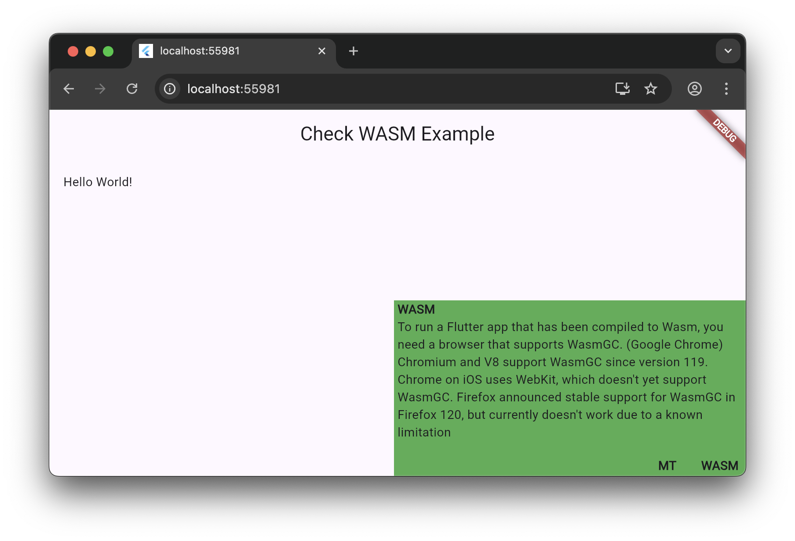

# check_wasm

Check if WASM is correctly configured. Checks if WASM version is loaded and multiheading is supported.

[![Watch on GitHub][github-watch-badge]][github-watch]
[![Star on GitHub][github-star-badge]][github-star]
[](https://pub.dev/packages/check_wasm)



## Getting Started

`Also see example project`

Wrap your root widget like below.
```dart
MaterialApp(
    home: CheckWasm(
        child: Scaffold(...),
    ),
),
```

## License

This project is licensed under the MIT License - see the 
[license] file for details.

[license]: https://github.com/Gerrel/check_wasm/blob/master/LICENSE
[github-watch-badge]: https://img.shields.io/github/watchers/Gerrel/check_wasm.svg?style=social
[github-watch]: https://github.com/Gerrel/check_wasm/watchers
[github-star-badge]: https://img.shields.io/github/stars/Gerrel/check_wasm.svg?style=social
[github-star]: https://github.com/Gerrel/check_wasm/stargazers
[releases]: https://github.com/Gerrel/check_wasm/releases
